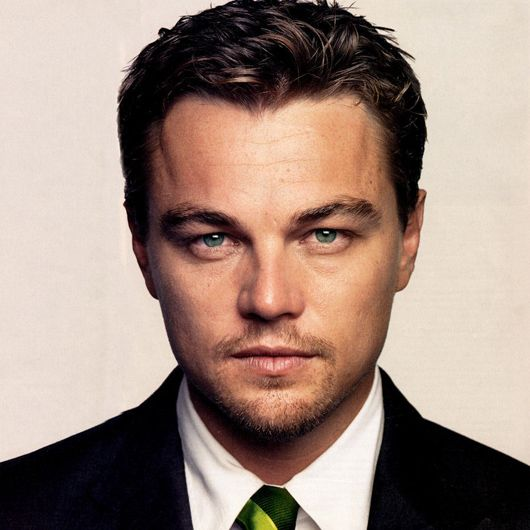
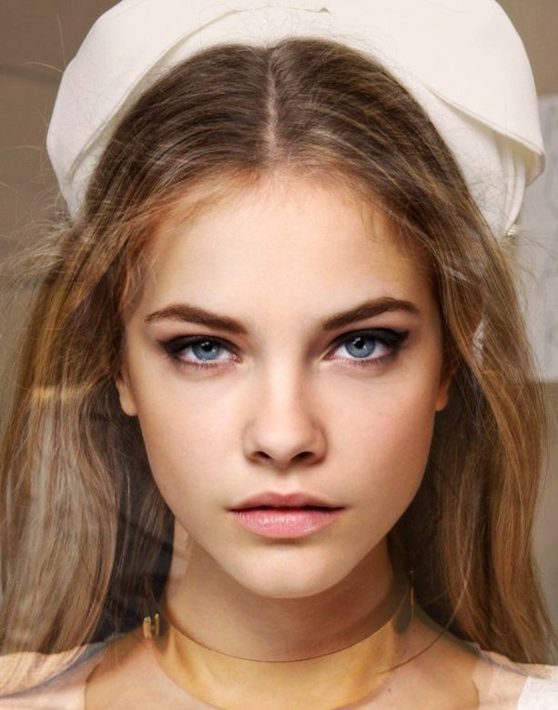
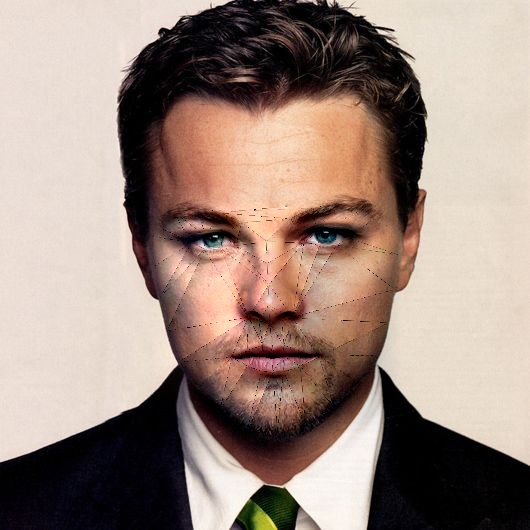

## Face Swap Application using Python and openCV

This is a flask-based application where we can swap the face of two people and have some fun with it. The model used is shape_predictor_68_face_landmarks of both the faces uploaded which gives us the 68 points landmarks of the face as shown.The project has applications in fields such as hiding faces in videos to preserve the identity,in movies for stunt double artists etc.


## Source image and Destination Image



## Generated image


later it marks the landmarks and swaps the faces with the destination image. It also can adjust if the face is sideways, color contrast, and the size of the image too.

## Steps Used

1. Taking two images – one as the source and another as a destination.
2. Using the dlib landmark detector on both these images. 
3. Joining the dots in the landmark detector to form triangles. 
4. Extracting these triangles
5. Create the mask using these triangles
5. Replacing the mask of the source image with the destination image
6. Smoothening the face


## 🧑‍💻 How to setup
create fresh conda environment 
```python
conda create -p venv python=3.7 -y
```
activate conda environment
```python
conda activate venv/
```
Install requirements
```python
pip install -r requirements.txt
```
Run the web app
```python
python app.py
```
To launch swagger ui
```python
http://localhost:5000/
```

**<center> NOTE: upload the photos with frontal face. </center>**

## 🧑‍💻 Tech Used
1. computer vision
2. dlib 
3. openCV 
4. Flask
5. Deployment using Amazon EC2 instance with ECR

## 🏭 Industrial Use-cases 
1. Add effects to the photos
2. Instagram and Snapchat filters

## 👋 Conclusion
We can create our own custom filter for the images and do our color grading using the cv2 library.
